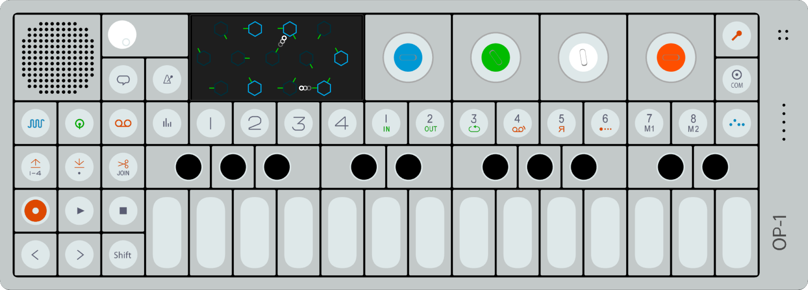

# ThreeJS OP-1

[**DEMO**](https://tomashubelbauer.github.io/three-op-1)

This is a [parallel project](https://github.com/TomasHubelbauer/webgl-op-1) to
my other one where I attempt to model and render an OP-1 by Teenage Engineering
using pure WebGL. It's pretty hard so I've created this meanwhile so that I can
have something to hopefully progress on faster and carry over ideas to the
original repository.

It looks like ThreeJS doesn't really have many modeling tools by a quick look,
but I might find it does or in the case of this project I will be happier to use
CSG.js whereas in my pure WebGL demo I prefer to tesselate the parts by hand and
try to avoid it.

---

This shows some basic modeling and sculpting API:

https://threejs.org/docs/#api/en/geometries/ExtrudeBufferGeometry

I started this project using this guide:

https://threejs.org/docs/index.html#manual/en/introduction/Creating-a-scene
